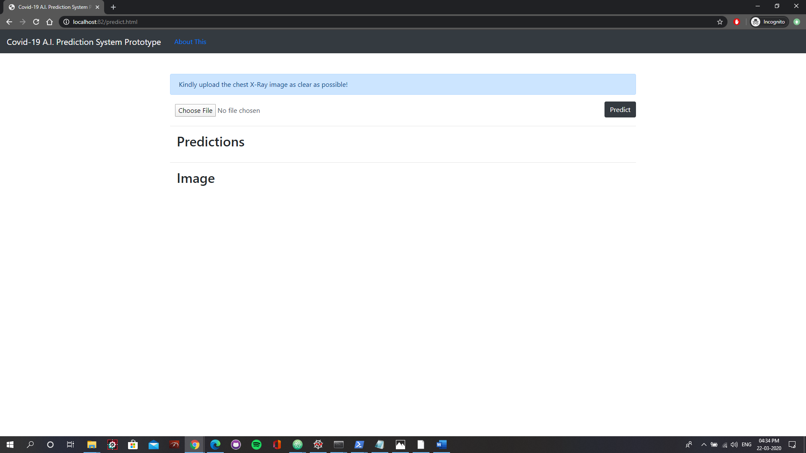
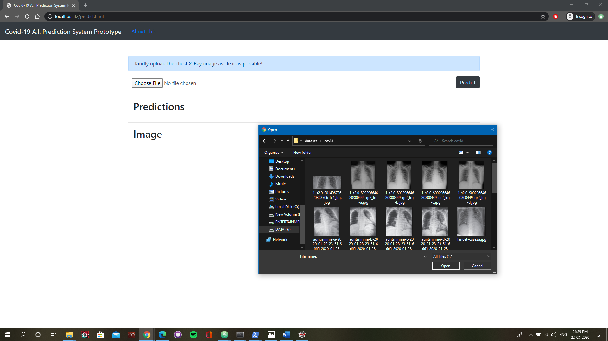
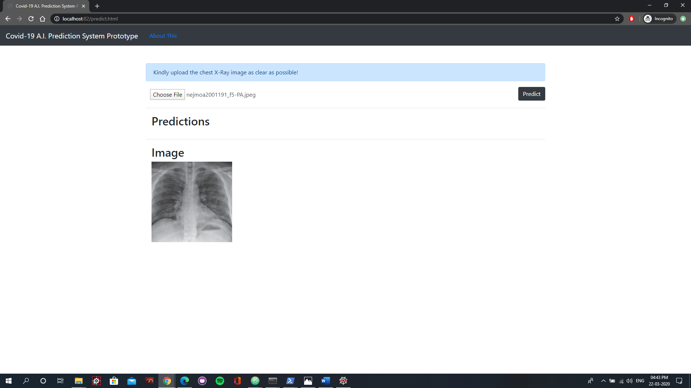
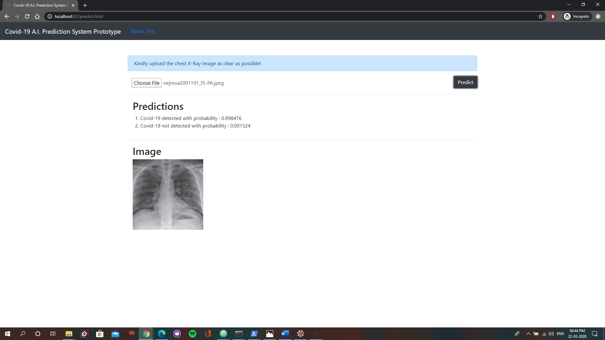
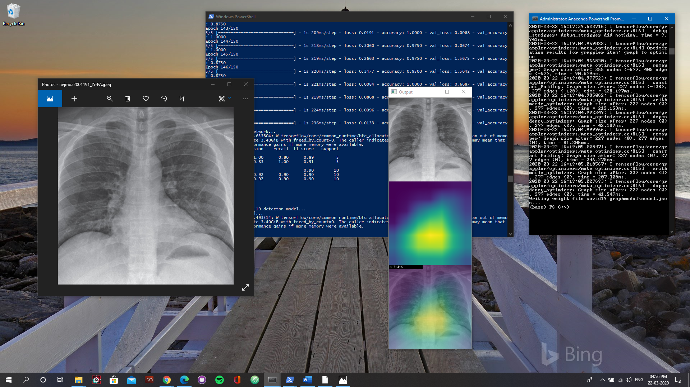

# Covid19_Diagnosis
A webapp for diagnosis of Covid-19 from X-Ray and CT images

WORKING :

Step 1 : Open the web application

Step 2 : Open the X-Ray image

Step 3 : Image gets loaded

Step 4 :  Click on Predict and wait for a few moments to get the prediction.

BEHIND THE SCENES WORKING:

 
Figure : A heat map of where the A.I. system is focusing on.
